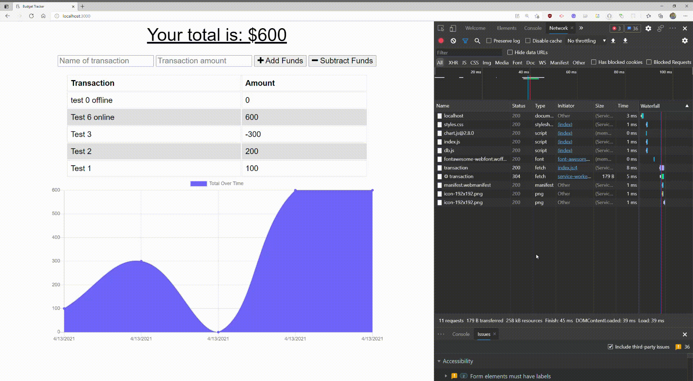

# FitnessTracker
  Github Page: https://github.com/Glatorian13/BudgetTrackerPWA
  Live Heroku Demo: https://budget-track-a.herokuapp.com/
# Description
  This is a budget tracker using a nosql database as the backend component. Simple to use, has charting functionality too.

  The main idea is that this is a simple Progressive Web Application. It will work without a network connection once cached. On reconnect, it will submit any data inputed by the user.
  # Table of Content
  * [Installation](#installation)
  * [Usage](#usage)
  * [License](#license)
  * [Contributors](#contributors)
  * [Tests](#tests)
  * [Questions](#questions)
  * [Walkthrough](#walkthrough)
  # Installation
  The following necessary dependencies must be installed to run the application properly: mongodb local or heroku sever, npm dependencies (express, mongoose, morgan, compression)
  # Usage
  In order to use this app, Install, all dependencies, set-up database, then run node server.js. Use application on Heroku deployment or localhost:3000
  # License
  This project is licensed under the MIT license. 
  
  # Contributors
  ​Contributors: Javier Cardenas, Trilogy Education
  # Tests
  The following is needed to run the test: No tests needed. Use postman for detailed api testing
  # Questions
  If you have any questions about the repo, open an issue or contact Glatorian13 directly at : glatorian13@gmail.com.
  # Walkthrough
  